# YouTube Transcript Extractor

A powerful Chrome extension that automated extracts YouTube video transcripts (in BULK) and saves them as JSON files. Supports single videos, playlists, channel videos, and batch processing with automatic rate limiting.

I built this extension to streamline the scrapping of transcripts from youtube videos for developing a rag based chatbot built on top of knowledge base from youtube videos.

I was facing difficulties in extracting transcripts using "youtube-transctipt-api" in python due to rate limit and paid proxy servers.The other tools were either paid or did not support the bulk scrapping of transcripts so I came up with the idea of this extension.

<span style="background-color: #FFFF00">Only con is that, it does not work in background, it manipulates DOM in realtime and youtube has to be open all the time. </span>


## Features

### 🎯 Single Video Extraction
- Extract transcripts from any YouTube video with one click
- Automatic transcript loading (clicks "Show transcript" button if needed)
- Downloads as JSON format with metadata (channel, video ID, transcript)
- Preview transcript before downloading

### 📋 Playlist & Channel Support
- Extract video IDs from YouTube playlists
- Extract video IDs from channel videos pages (`/@channel/videos`)
- Supports regular videos and YouTube Shorts
- Automatic scrolling to load all videos
- Save extracted IDs to browser storage
- Download video IDs as text file

### ⚡ Batch Processing
- Process multiple videos automatically
- Configurable batch sizes
- Real-time progress tracking with batch numbers
- Smart rate limiting (5-15 second random delays)
- Retry logic for failed extractions
- Detailed logging (success, skipped, failed)
- Pause/stop functionality

### 💾 Storage & Management
- Automatic saving to browser storage
- Load previously extracted video IDs
- Persistent across browser sessions
- Export video IDs in batch-ready format

## Workflow Diagrams

### Quick Start: Single Video Extraction

```mermaid
flowchart TD
    A[Open YouTube Video] --> B[Click Extension Icon]
    B --> C[Open Side Panel]
    C --> D[Click 'Extract Transcript']
    D --> E{Transcript Visible?}
    E -->|No| F[Auto-click 'Show transcript']
    E -->|Yes| G[Extract Transcript]
    F --> G
    G --> H[Download JSON File]
    H --> I[✅ Complete<br/>30 seconds]
    
    style A fill:#e1f5ff
    style I fill:#c8e6c9
```



### Playlist/Channel to Batch Processing

```mermaid
flowchart TD
    A[Copy Playlist/Channel URL] --> B[Open Extension Side Panel]
    B --> C[Go to Playlist Tab]
    C --> D[Paste URL]
    D --> E[Click Extract Video IDs]
    E --> F[Auto-scroll & Extract]
    F --> G{What Next?}
    G -->|Save for Later| H[Download Video IDs]
    G -->|Process Now| I[Use for Batch Process]
    H --> J[Save to Storage]
    I --> K[Go to Batch Process Tab]
    J --> K
    K --> L[Set Batch Size<br/>Default: 10]
    L --> M[Click Start Batch Process]
    M --> N[Monitor Progress<br/>Real-time Updates]
    N --> O[✅ All Transcripts<br/>Downloaded]
    
    style A fill:#e1f5ff
    style O fill:#c8e6c9
```



### Batch Processing Flow


### Large Channel Extraction Strategy

```mermaid
flowchart TD
    A[Go to Channel<br/>Videos Page] --> B[Extract All<br/>Video IDs]
    B --> C[Download<br/>video_ids.txt]
    C --> D{Total Videos?}
    D -->|< 50| E[Process in<br/>One Session]
    D -->|50-100| F[Split into<br/>2 Sessions]
    D -->|> 100| G[Split into<br/>Multiple Sessions]
    
    E --> H[Batch Size: 15-20]
    F --> I[Batch Size: 20]
    G --> J[Batch Size: 20]
    
    H --> K[Start Batch]
    I --> L[Process First 50]
    J --> M[Process First 50]
    
    L --> N[⏸️ Wait<br/>10-15 min]
    M --> N
    N --> O[Process Next 50]
    O --> P{More Videos?}
    P -->|Yes| N
    P -->|No| Q[✅ Complete]
    
    K --> Q
    
    style A fill:#e1f5ff
    style Q fill:#c8e6c9
    style N fill:#fff9c4
```



### Error Recovery Workflow

```mermaid
flowchart TD
    A[⚠️ Batch Processing<br/>Failed/Stopped] --> B{Check Error Type}
    
    B -->|Rate Limited| C[Stop Processing]
    B -->|No Transcript| D[Check Log for<br/>Skipped IDs]
    B -->|Network Error| E[Check Connection]
    B -->|Browser Crash| F[Reopen Browser]
    
    C --> G[⏸️ Wait<br/>10-15 minutes]
    D --> H[Remove<br/>Skipped IDs]
    E --> I[Reduce<br/>Batch Size]
    F --> J[Load from Storage]
    
    G --> K[Copy Remaining<br/>Unprocessed IDs]
    H --> K
    I --> K
    J --> K
    
    K --> L[Reduce Batch Size<br/>by 50%]
    L --> M[Restart Batch Process]
    M --> N{Success?}
    N -->|Yes| O[✅ Complete]
    N -->|No| P[⚠️ Manual<br/>Investigation]
    
    style A fill:#ffcdd2
    style O fill:#c8e6c9
    style P fill:#fff9c4
```



### Daily Channel Monitoring

```mermaid
flowchart TD
    A[📅 Day 1<br/>Initial Setup] --> B[Extract Channel<br/>Video IDs]
    B --> C[Save as<br/>channel_2024-11-24.txt]
    C --> D[Process All<br/>Transcripts]
    D --> E[⏰ Wait Until<br/>Next Day]
    
    E --> F[📅 Day 2<br/>Check Updates]
    F --> G[Extract Channel<br/>Video IDs]
    G --> H[Save as<br/>channel_2024-11-25.txt]
    H --> I[📊 Compare Files<br/>Find Differences]
    I --> J{New Videos?}
    
    J -->|Yes| K[Extract New<br/>Video IDs Only]
    J -->|No| L[✅ No Updates]
    
    K --> M[Process New<br/>Transcripts]
    M --> N[Archive Files]
    N --> E
    
    style A fill:#e1f5ff
    style L fill:#c8e6c9
    style N fill:#c8e6c9
```



## Installation & Setup

### Step 1: Download the Extension

**Option A: Clone with Git**
```bash
git clone https://github.com/yourusername/youtube-transcript-extractor.git
cd youtube-transcript-extractor
```

**Option B: Download ZIP**
1. Click the green "Code" button on GitHub
2. Select "Download ZIP"
3. Extract the ZIP file to a folder on your computer
4. Remember the folder location (e.g., `C:\Extensions\youtube-transcript-extractor`)

### Step 2: Install in Chrome

```mermaid
flowchart LR
    A[Open Chrome] --> B[Go to chrome://extensions/]
    B --> C[Enable Developer ModeToggle top-right]
    C --> D[Click Load unpacked]
    D --> E[Select extension folder]
    E --> F[✅ Extension Installed]
    
    style A fill:#e1f5ff
    style F fill:#c8e6c9
```



**Detailed Steps:**

1. **Open Chrome Extensions Page**
   - Open Google Chrome browser
   - Type `chrome://extensions/` in the address bar and press Enter
   - Or: Click ⋮ (three dots) → More tools → Extensions

2. **Enable Developer Mode**
   - Look for "Developer mode" toggle in the top-right corner
   - Click to turn it ON (it will turn blue)
   - You'll see new buttons appear: "Load unpacked", "Pack extension", "Update"

3. **Load the Extension**
   - Click the "Load unpacked" button
   - Navigate to the folder where you downloaded/cloned the extension
   - Select the main folder (contains `manifest.json`)
   - Click "Select Folder" or "Open"

4. **Verify Installation**
   - You should see the extension card appear
   - Extension name: "YouTube Transcript Extractor"
   - Status should show: Enabled ✓
   - You'll see the extension icon in your Chrome toolbar

### Step 3: First Time Setup

1. **Pin the Extension** (Recommended)
   - Click the puzzle piece icon 🧩 in Chrome toolbar
   - Find "YouTube Transcript Extractor"
   - Click the pin 📌 icon to keep it visible

2. **Test the Extension**
   - Go to any YouTube video
   - Click the extension icon
   - Side panel should open on the right side
   - You should see three tabs: Single Video, Playlist, Batch Process

### Installation Verification

✅ **Check these items:**
- [ ] Extension appears in `chrome://extensions/`
- [ ] Extension is enabled (toggle is blue)
- [ ] No errors shown on the extension card
- [ ] Extension icon visible in toolbar (if pinned)
- [ ] Side panel opens when clicking the icon on YouTube
- [ ] All three tabs are visible in the side panel

### Troubleshooting Installation

**Problem: "Manifest file is missing or unreadable"**
- Make sure you selected the correct folder
- The folder must contain `manifest.json` file
- Re-download or re-clone if files are corrupted

**Problem: Extension doesn't appear in toolbar**
- Click the puzzle piece 🧩 icon
- Find the extension in the list
- Click the pin icon to make it visible

**Problem: "This extension may have been corrupted"**
- Click "Repair" button on the extension card
- If that doesn't work, remove and reinstall:
  1. Click "Remove"
  2. Refresh the extensions page
  3. Load unpacked again

**Problem: Side panel doesn't open**
- Make sure you're on a YouTube page
- Try refreshing the YouTube page
- Check if extension is enabled in `chrome://extensions/`
- Try clicking the extension icon again

### Updating the Extension

When you pull updates from the repository:

1. Go to `chrome://extensions/`
2. Find "YouTube Transcript Extractor"
3. Click the refresh/reload icon 🔄 on the extension card
4. Or click "Update" button at the top of the extensions page

### Uninstalling

If you want to remove the extension:

1. Go to `chrome://extensions/`
2. Find "YouTube Transcript Extractor"
3. Click "Remove"
4. Confirm removal
5. Delete the extension folder from your computer (if desired)


## Usage

### Single Video Extraction

1. Navigate to any YouTube video
2. Click the extension icon to open the side panel
3. Go to the "Single Video" tab
4. Click "Extract Transcript"
5. The transcript will be automatically downloaded as JSON

**Output Format:**
```json
{
  "channel_username": "channelname",
  "video_id": "dQw4w9WgXcQ",
  "transcript": "Full transcript text here..."
}
```

### Playlist/Channel Extraction

1. Copy a YouTube playlist or channel URL:
   - Playlist: `https://www.youtube.com/playlist?list=PLxxxxxx`
   - Channel: `https://www.youtube.com/@channelname/videos`
2. Open the extension side panel
3. Go to the "Playlist" tab
4. Paste the URL
5. Click "Extract Video IDs"
6. Wait for extraction to complete (auto-scrolls through all videos)
7. Choose to:
   - Download video IDs as text file
   - Use for batch processing immediately
   - Save to storage for later use

### Batch Processing

1. Go to the "Batch Process" tab
2. Add video IDs using one of these methods:
   - Click "Load from Storage" (if you extracted a playlist)
   - Paste video IDs manually (one per line or comma-separated)
   - Use "Use for Batch Process" from Playlist tab
3. Set your desired batch size (default: 10)
4. Click "Start Batch Process"
5. Monitor progress in real-time
6. Transcripts are automatically downloaded as they're extracted

**Batch Features:**
- Progress bar with percentage
- Current batch number display (e.g., "Batch 2/5")
- Success/skipped/failed counters
- Detailed log with timestamps
- Stop button to pause processing
- Automatic retry on failures (up to 3 attempts)

## Supported URL Formats

### Playlists
- `https://www.youtube.com/playlist?list=PLxxxxxx`
- `https://www.youtube.com/watch?v=xxxxx&list=PLxxxxxx`
- `PLxxxxxx` (just the playlist ID)

### Channels
- `https://www.youtube.com/@channelname/videos`
- `https://www.youtube.com/channel/UCxxxxxx/videos`
- `https://www.youtube.com/c/channelname/videos`
- `https://www.youtube.com/user/username/videos`

## Quick Reference

### Batch Size Guidelines

| Connection Speed | Recommended Batch Size | Use Case |
|-----------------|------------------------|----------|
| Fast & Stable | 20-25 videos | Quick processing, low risk |
| Average | 15-20 videos | **Recommended default** |
| Slow/Unstable | 5-10 videos | Reliable, fewer timeouts |
| Testing | 3-5 videos | Initial testing |

### Time Estimates

| Task | Videos | Estimated Time |
|------|--------|----------------|
| Single extraction | 1 | 30 seconds |
| Playlist extraction | 50 videos | 1-2 minutes |
| Channel extraction | 200 videos | 2-3 minutes |
| Batch processing | 10 videos | 3-5 minutes |
| Batch processing | 50 videos | 15-25 minutes |
| Batch processing | 100 videos | 30-50 minutes |

### Video ID Formats

You can paste video IDs in any of these formats:

```
One per line:
dQw4w9WgXcQ
jNQXAC9IVRw
oHg5SJYRHA0

Comma-separated:
dQw4w9WgXcQ,jNQXAC9IVRw,oHg5SJYRHA0

Mixed:
dQw4w9WgXcQ, jNQXAC9IVRw
oHg5SJYRHA0
```

## File Structure

```
youtube-transcript-extractor/
├── manifest.json          # Extension configuration
├── background.js          # Service worker
├── content.js            # Content script (runs on YouTube pages)
├── sidepanel.html        # Side panel UI
├── sidepanel.css         # Side panel styles
├── sidepanel.js          # Side panel logic
├── popup.html            # Popup UI (legacy)
├── popup.js              # Popup logic (legacy)
├── icon16.png            # Extension icon (16x16)
├── icon48.png            # Extension icon (48x48)
├── icon128.png           # Extension icon (128x128)
├── README.md             # This file
├── INSTALL.md            # Installation guide
├── FEATURES.md           # Detailed features documentation
└── WORKFLOWS.md          # Usage workflows and examples
```

## Permissions

- `activeTab` - Access current YouTube tab
- `scripting` - Inject content scripts
- `sidePanel` - Display side panel interface
- `tabs` - Navigate between videos during batch processing
- `storage` - Save video IDs to browser storage

## Rate Limiting

The extension implements smart rate limiting to avoid YouTube restrictions:
- Random delays between 5-15 seconds between videos
- Retry logic with exponential backoff
- Automatic detection of unavailable transcripts
- Graceful handling of errors

## Troubleshooting

### "No transcript found"
- The video may not have captions/transcripts available
- Try refreshing the page and clicking extract again
- Some videos have transcripts disabled by the creator

### "Please refresh the page and try again"
- Refresh the YouTube page
- Make sure you're on a video page (`youtube.com/watch?v=...`)
- Check that the extension has permission to access YouTube

### Batch processing stops unexpectedly
- Check your internet connection
- YouTube may have rate limited your requests (wait a few minutes)
- Try reducing the batch size
- Increase delays by stopping and restarting

### Video IDs not extracting from playlist
- Make sure the playlist is public
- Try scrolling manually first to load videos
- Some playlists may be region-restricted

## Tips & Best Practices

1. **Batch Size**: Start with 10 videos per batch. Increase if stable, decrease if errors occur.
2. **Rate Limiting**: Don't process more than 50-100 videos in one session.
3. **Storage**: Regularly download your extracted video IDs as backup.
4. **Monitoring**: Watch the batch log for patterns in failures.
5. **Retries**: The extension automatically retries failed extractions 3 times.
6. **Large Channels**: For 100+ videos, split into multiple sessions with breaks.
7. **Daily Monitoring**: Save dated files to track new uploads over time.
8. **Backup**: Always download video IDs before batch processing.

## Common Use Cases

### Research Dataset Creation
1. Extract all video IDs from target channels
2. Save master list as backup
3. Process in batches of 50 with 15-minute breaks
4. Organize transcripts by channel/topic
5. Create index file with metadata

### Content Analysis
1. Extract transcripts from specific playlist
2. Process all videos in one batch
3. Use JSON files for text analysis
4. Track video IDs for citation

### Channel Monitoring
1. Extract baseline video IDs (Day 1)
2. Daily: Extract current video IDs
3. Compare to find new videos
4. Process only new transcripts
5. Archive with date stamps

## Development

### Technologies Used
- Manifest V3
- Chrome Extension APIs
- Vanilla JavaScript
- CSS3

### Key Components
- **Content Script**: Interacts with YouTube DOM to extract transcripts
- **Side Panel**: Main user interface
- **Background Worker**: Handles extension lifecycle
- **Storage API**: Persists video IDs across sessions

## Version History

### v1.0 (Current)
- Single video transcript extraction
- Playlist video ID extraction
- Channel videos support
- Batch processing with configurable sizes
- Browser storage integration
- Rate limiting and retry logic
- JSON output format
- Auto-click transcript button

## Contributing

Contributions are welcome! Please feel free to submit issues or pull requests.

## License

MIT License - feel free to use and modify as needed.

## Support

For issues, questions, or feature requests, please open an issue on the repository.

---

**Note**: This extension is for personal use and educational purposes. Please respect YouTube's Terms of Service and rate limits.
